# Operaciones Matematicas


La aplicación de operaciones matematicas es un ejercicio práctico para la empresa Cyxtera la cual permite resolver una problematica usando un conjunto de tecnologias:

# Tecnologias Usadas

**Spark** Microframework para crear aplicaciones web [Spark](http://sparkjava.com/documentation#request) se uso para implementar los servicios rest.

**slf4j** Simple Logging Facade for Java [slf4j](http://www.slf4j.org/) se uso para implementar el sistema de logs rest.

**Junit** Framework para testear aplicaciones Java [Junit](https://junit.org/junit5/) se uso para implementar pruebas unitarias.

**Sqlite** Sistema de gestion de base datos liviano y autocontenido [Sqlite](https://www.sqlite.org/index.html) se uso para implementar la auditoria.


## Instalacion

Luego de clonar el repositorio y acceder al proyecto desde tu IDE favorito, se debe ejecutar la operacion RUN As --> Java Application sobre la clase OperacionesRest, la cual lanza el menu visual y direcciona a la implementacion de los servicios REST


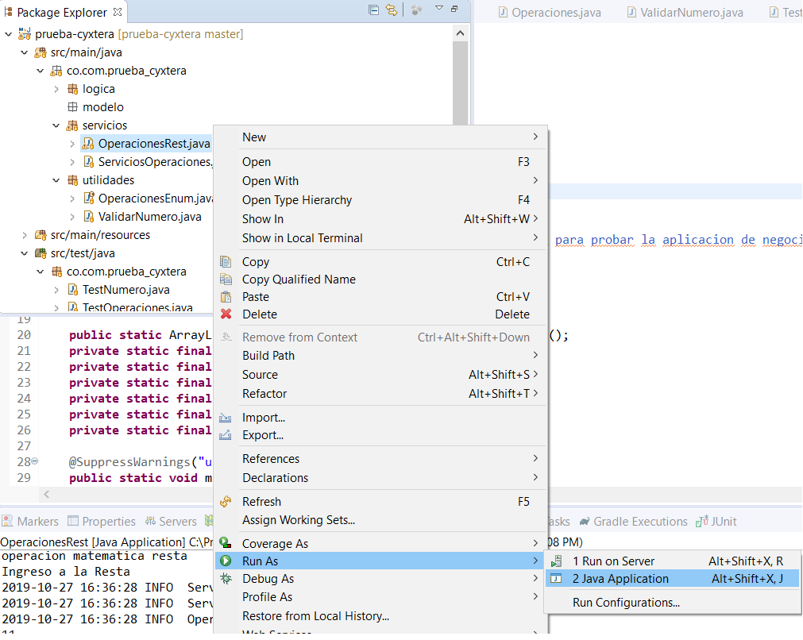

La forma de verificar que el servicio esta disponible por el puerto 8081 que fue el definido es por la consola del IDE tal como se muestra a continuacion.

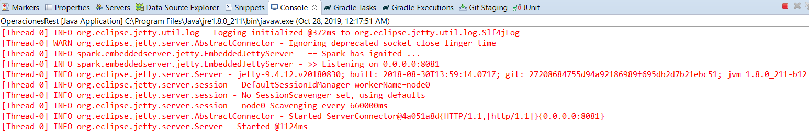

Para hacer uso del log se debe ingresar al archivo log4j.properties que se encuentra localizado en src/main/resources y modificar el path del atributo log4j.appender.file.File y direccionar a uno que
se tenga permisos de escritura dentro del laptop o desktop. Como se indica en la figura

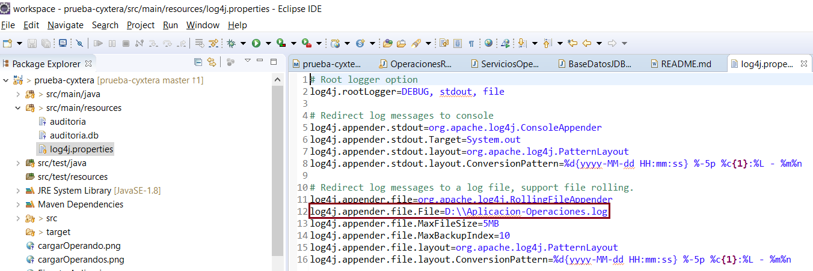  


##Instalar base de datos SQlite

La base de datos sqlite es un sistema de gestion de datos liviana y portable dentro del proyecto se agrego la base de datos portable, sin embargo como se va descargar en otro equipo se debe modificar
la ruta donde va quedar instalada la aplicacion
 
Descargar del sitio ** [sqlite]**(https://www.sqlite.org/download.html)

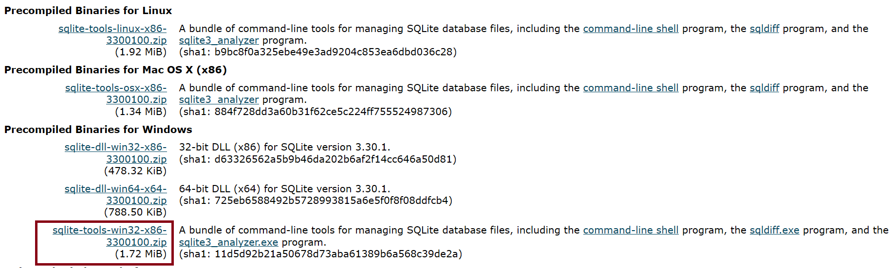 

Descomprimir el precompilado binario en el path de la maquina que desee pero recuerde de configurar las variables de entorno del sistema operativo Windows en el PATH para que desde cualquier terminal de DOS puede acceder

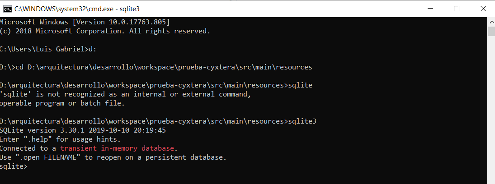 

lanzar comando sqlite3 auditoria para crear la base de datos tal como se indica a continuacion

```bash
$sqlite3 auditoria
```
Dentro de sqlite3 ejecutar el siguiente script para crear la tabla

```bash
CREATE TABLE auditoria_operaciones (
id INTEGER PRIMARY KEY AUTOINCREMENT,
id_session TEXT NOT NULL,
fecha_operacion TEXT NOT NULL,
tipo_operacion TEXT NOT NULL,
operacion TEXT NOT NULL,
resultado INTEGER);
```
Cambiar el path de donde se creo la base de datos dentro del archivo config.properties

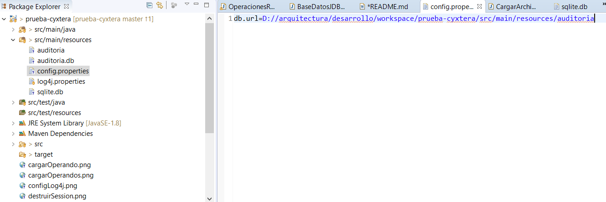

Registros de Auditoria

Ingresando al shell de sqlite se pueden verificar la informacion registrada por la aplicacion

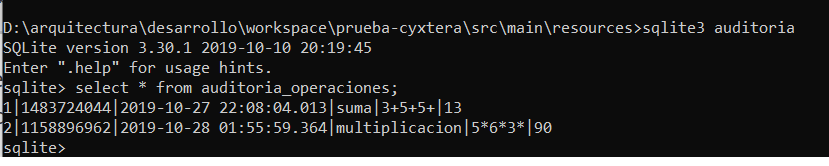

Tambien se diseño un servicio rest que consultara la base de datos de auditoria. En el siguiente ejemplo dado el id de session se obtiene la info de base de datos

```bash
http://localhost:8081/audita?id=1483724044
```


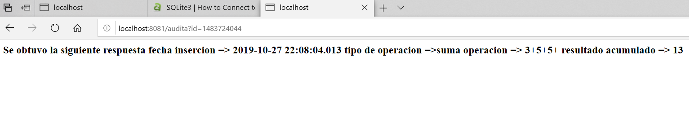

## Uso de la Aplicacion
La aplicacion para su compilación y ejecución usa JDK 1.8. A pesar que el pom maven se agrego la configuración es recomendable dentro del IDE configurar la version correcta 

```bash
	<properties>
		<maven.compiler.target>1.8</maven.compiler.target>
		<maven.compiler.source>1.8</maven.compiler.source>
	</properties>
```


## Menu de la Aplicación usando Servicios Rest

```xml
Luego de haber ejecutado la aplicación por su IDE favorito se ingresa al browser y coloca la siguiente URI --> http://localhost:8081/menu
```

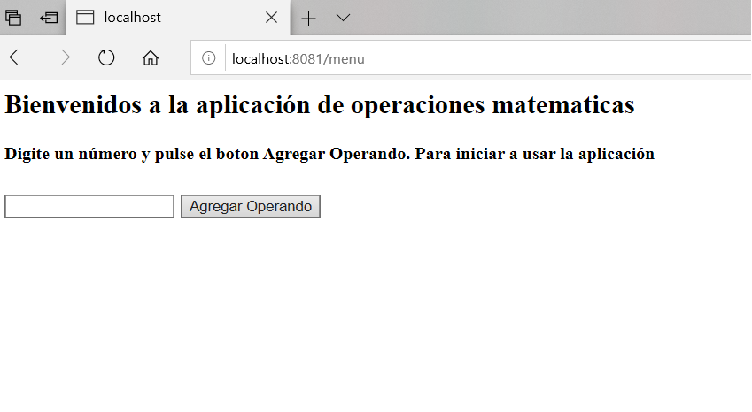

Para iniciar una nueva sesion y lanzar el aplicativo debe agregar un numero u operando y pulsar sobre el boton de Agregar Operando

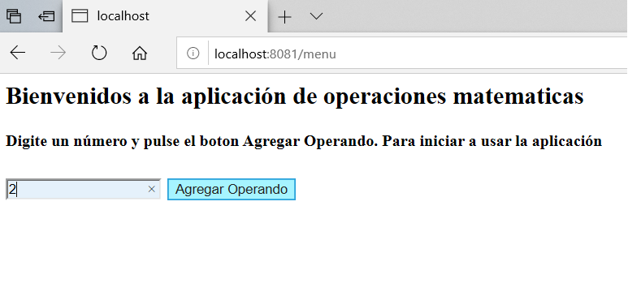

El menu principal de operaciones permite agregar n operandos, simplemente digitando el numero y pulsando el boton agregar Operando 

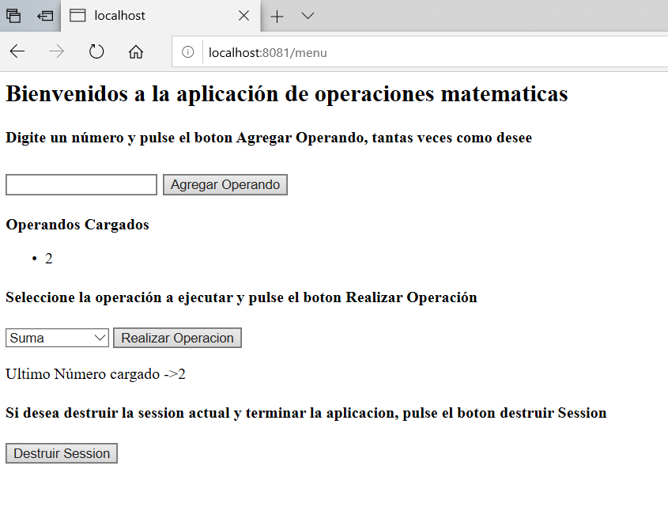

Como modo de ejemplo se muestra como se agrego un operando

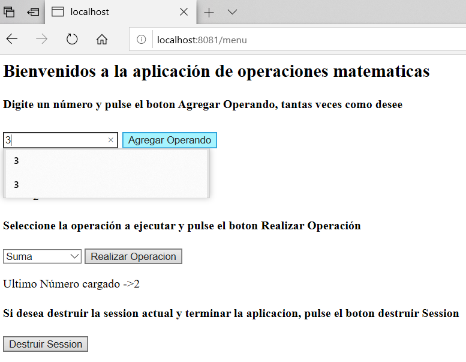

Luego que halla agregado un grupo de operandos o numeros, se puede elegir el tipo de operación (suma, resta, division, multiplicación y potenciación) y se procede a pulsar el boton Realizar Operación

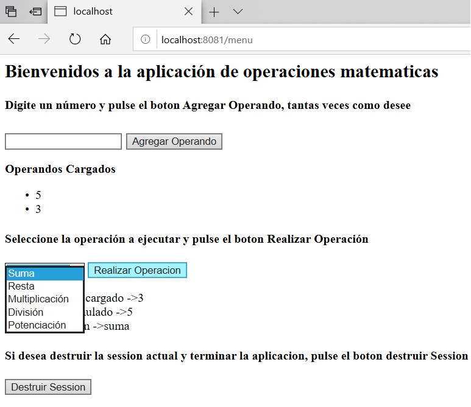

Como resultado final de las operaciones se muestran los valores de:
Ultimo número cargado, Ultima operacion ejecutada y resultado acumulado de ejecución de la operación

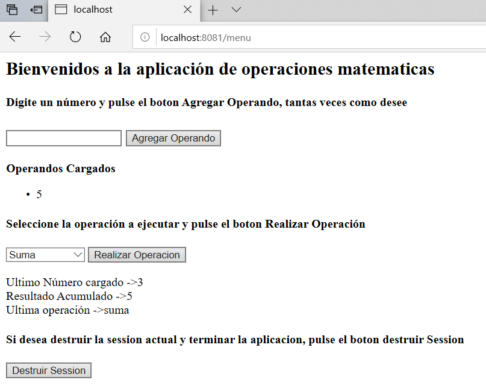

Finalmente si desea destruir la session y reiniciar la aplicacion debe pulsar el boton Destruir Session lo cual lo direcciona al menu principal

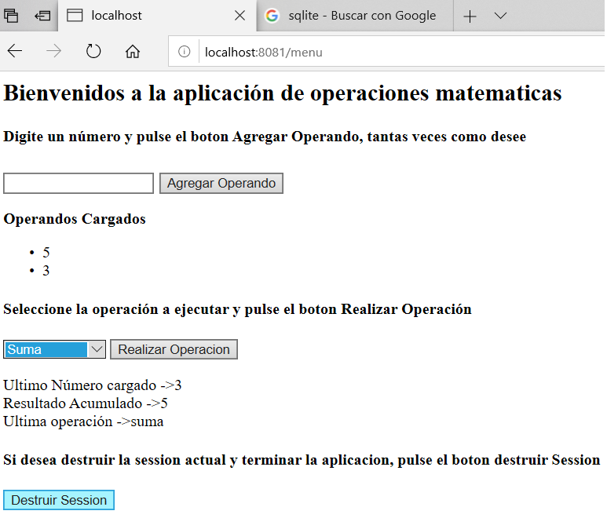


